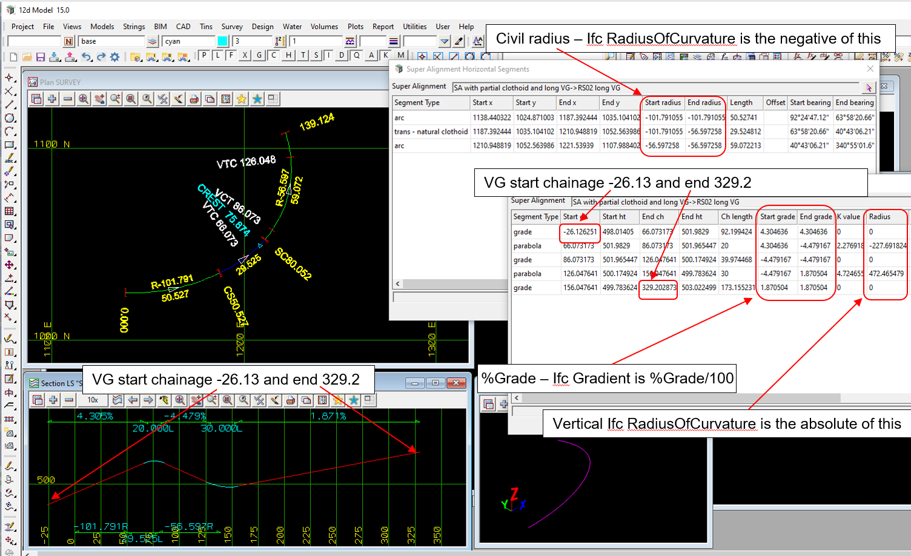

### Intent

This scenario has an alignment where the vertical alignment starts before the start of the horizontal alignment
and extends past the end of the horizontal alignment.
The start chainage is 0.

That is, it has 
Civil Horizontal:

- left arc
- partial clothoid transition of IFC positive decreasing radius of curvature
- left arc

Civil Vertical Geometry:

- straight
- crest parabola 
- straight
- sag parabola
- the vertical starts before the horizontal and extends past the end of the horizontal

In the IFC file there is only the IFC semantic definition of the alignment and no IFC geometry.

 

The IFC file was generated by 12d Model. 

### Prerequisites

This scenario builds upon the scenarios:

- Alignment-12d-7
- Alignment-12d-9

### Content

This scenario covers the additional concepts and/or IFC entities:

- the vertical alignment starts before the horizontal alignment and extends past the end of the horizontal alignment 

### Supporting files

Following files correspond to this scenario:

| Filename                  | Description                                                                                |
|---------------------------|--------------------------------------------------------------------------------------------|
| `Alignment-12d-10.ifc`    | the exported content as an IFC file                                                        |
| `Alignment-12d-10.png`    | plan view and section view of the alignment, and the segment parameters (with Civil radius)|

