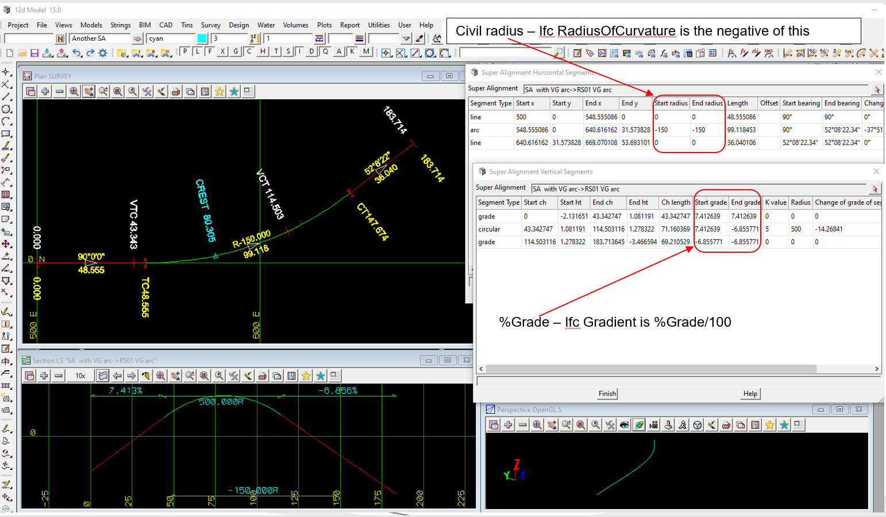

### Intent

This scenario has the IFC semantic definition of an alignment with:

Civil Horizontal:

- horizontal straight
- horizontal arc with IFC positive radius of curvature
- horizontal straight

Civil Vertical:

- vertical straight
- vertical crest arc
- vertical straight

There is no IFC geometry.

 

The IFC file was generated by 12d Model. 

### Prerequisites

- Alignment-12d-1

### Content

This scenario covers the additional concepts and/or IFC entities:

- `IfcAlignmentVertical`
- `IfcAlignmentVerticalSegment` with `PredefinedType=CONSTANTGRADIENT`
- `IfcAlignmentVerticalSegment` with `PredefinedType=CIRCULARARC` for a crest

### Supporting files

Following files correspond to this scenario:

| Filename                        | Description                                                                                            |
|---------------------------------|--------------------------------------------------------------------------------------------------------|
| `Alignment-12d-2.ifc`           | the exported content as an IFC file                                                                    |
| `Alignment-12d-2.png`           | plan and long section view of the alignment, and the segment parameters (with Civil radius and percent Grade) |

