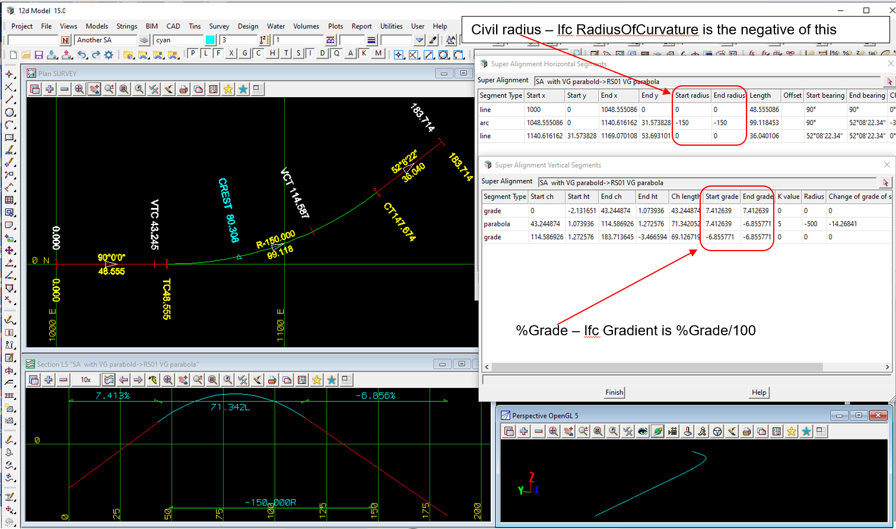

### Intent

This scenario has the IFC semantic definition of an alignment with:

Civil Horizontal:

- horizontal straight
- horizontal arc with IFC positive radius of curvature
- horizontal straight

Civil Vertical:

- vertical straight
- vertical crest parabola
- vertical straight

In the IFC file there is only the IFC semantic definition of the alignment and no IFC geometry.

 

The IFC file was generated by 12d Model. 

### Prerequisites

This scenario builds upon the scenarios

- Alignment-12d-1
- Alignment-12d-2

### Content

This scenario covers the additional concepts and/or IFC entities:

- `IfcAlignmentVerticalSegment` with `PredefinedType=PARABOLICARC` for a crest

### Supporting files

Following files correspond to this scenario:

| Filename                 | Description                                                                                            |
|--------------------------|--------------------------------------------------------------------------------------------------------|
| `Alignment-12d-3.ifc`    | the exported content as an IFC file                                                                    |
| `Alignment-12d-3.png`    | plan and long section view of the alignment, and the segment parameters (with Civil radius and percent Grade) |

