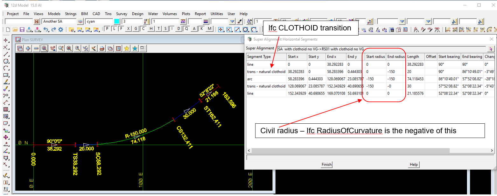

 
### Intent

This scenario has the IFC semantic definition of an alignment with:

Civil Horizontal:

- horizontal straight
- horizontal left clothoid transition with IFC positive radius of curvature going from 0 to 150
- horizontal left arc with IFC positive radius of curvature
- horizontal left clothoid transition with IFC positive radius of curvature going from 150 to 0
- horizontal straight

Civil Vertical: 

- none

In the IFC file there is only the IFC semantic definition of the alignment and no IFC geometry.

 

The IFC file was generated by 12d Model. 

### Prerequisites

This scenario builds upon the scenarios

- Alignment-12d-1

### Content

This scenario covers the additional concepts and/or IFC entities:

- `IfcAlignmentHorizontalSegment` with `PredefinedType=CLOTHOID` with positive radius of curvature

### Supporting files

Following files correspond to this scenario:

| Filename                        | Description                                                               |
|---------------------------------|---------------------------------------------------------------------------|
| `Alignment-12d-4.ifc`           | the exported content as an IFC file                                          |
| `Alignment-12d-4.png`           | plan and long section view of the alignment, and table of segment parameters |

