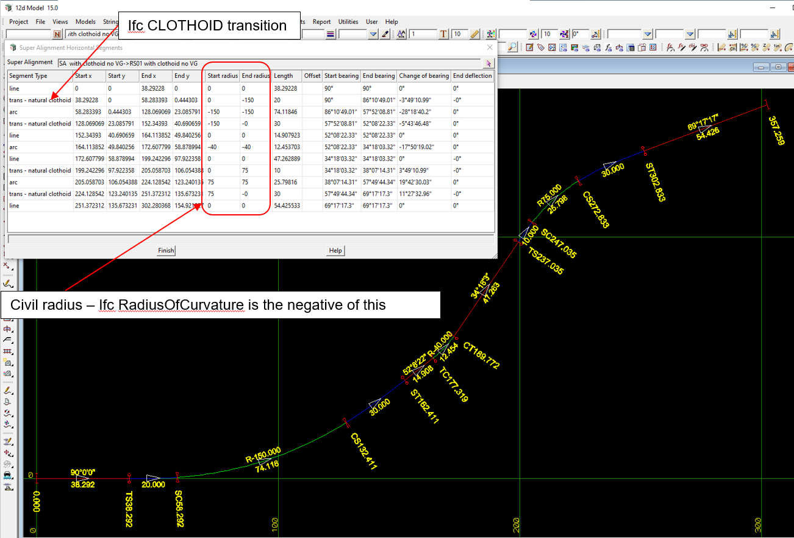

 
### Intent

This scenario has the IFC semantic definition of an alignment with:

Civil Horizontal:

- horizontal straight of length 38.292
- horizontal left clothoid transition of length 20 with IFC positive radius of curvature going from 0 to 150
- horizontal left arc of length 74.118 with IFC positive radius of curvature
- horizontal left clothoid transition of length 30 with IFC positive radius of curvature going from 150 to 0
- horizontal straight of length 14.9
- horizontal left arc of length 12.45 with IFC positive radius of curvature 40
- horizontal straight of length 47.26
- horizontal leading right clothoid transition of length 10 with IFC negative radius of curvature going from 0 to -75
- horizontal right arc of length 26.798 with IFC negative radius of curvature -75
- horizontal trailing right clothoid transition of length 30 with IFC negative radius of curvature going from -75 to 0
- horizontal straight of length 54.426

Civil Vertical: 

- none

In the IFC file there is only the IFC semantic definition of the alignment and no IFC geometry.

The IFC file was generated by 12d Model. 

### Prerequisites

This scenario builds upon the scenarios

- Alignment-12d-4

### Content

This scenario covers the additional concepts and/or IFC entities:

  `IfcAlignmentHorizontalSegment` with `PredefinedType=CLOTHOID` with negative radius of curvature
  `IfcAlignmentHorizontalSegment` with `PredefinedType=CIRCULARARC` with negative radius of curvature

### Supporting files

Following files correspond to this scenario:

| Filename                        | Description                                                |
|---------------------------------|------------------------------------------------------------|
| `Alignment-12d-5.ifc`           | the exported content as an IFC file                        |
| `Alignment-12d-5.png`           | plan view of the alignment and table of segment parameters |

