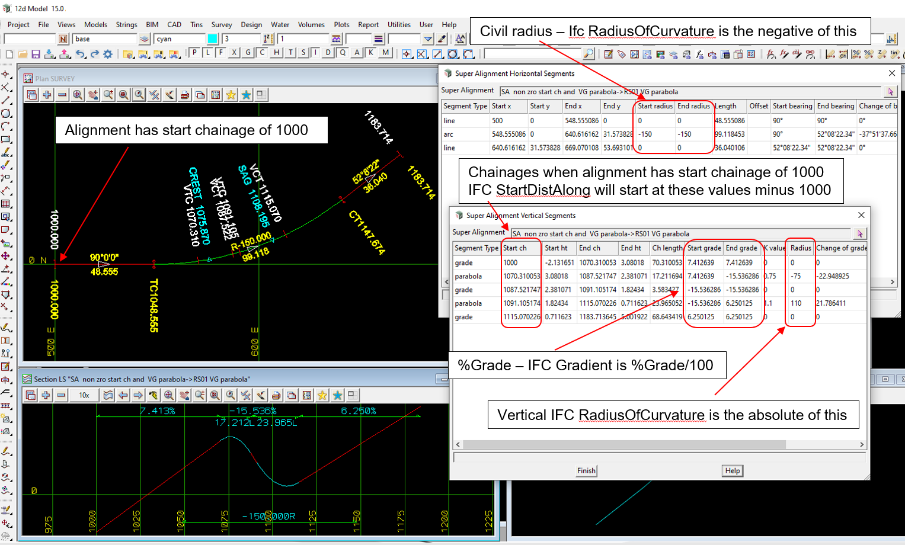

### Intent

This scenario has an alignment with start chainage of 1000, left arc in horizontal and crest and sag parabolas for vertical.

That is, it has 
Civil Horizontal:

- horizontal start chainage of 1000
- horizontal straight
- horizontal arc with IFC positive radius of curvature
- horizontal straight

Civil Vertical:

- vertical straight
- vertical crest parabola
- vertical straight
- vertical sag parabola
- vertical straight

My understanding is that nothing will change in the `IfcAlignmentVerticalSegment` from Alignment-12d-7 
because `IfcAlignmentVerticalSegment.StartDistAlong` is only measured from the start of the horizontal and ignores `IfcAlignmentHorizontal.StartDistAlong` 
So the IFC Geometry alone is not enough to calculate the chainage of a point on the IfcAlignment. 

In the IFC file there is only the IFC semantic definition of the alignment and no IFC geometry.

The IFC file was generated by 12d Model. 

### Prerequisites

This scenario builds upon the scenarios:

- Alignment-12d-7 with the addition of a start chainage of 1000

### Content

This scenario covers the additional concepts and/or IFC entities:

 `IfcAlignmentHorizontal` with `IfcAlignmentHorizontal.StartDistAlong=1000`

### Supporting files

Following files correspond to this scenario:

| Filename                | Description                                                                                            |
|-------------------------|--------------------------------------------------------------------------------------------------------|
| `Alignment-12d-8.ifc`   | the exported content as an IFC file                                                                    |
| `Alignment-12d-8.png`   | plan and long section view of the alignment, and the segment parameters (with Civil radius and percent Grade) |

