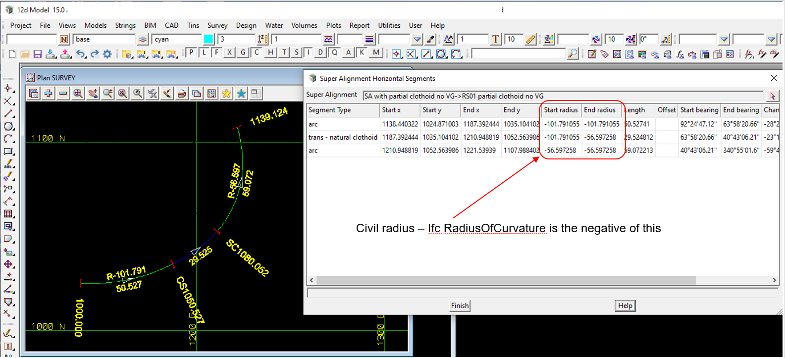

### Intent

This scenario has an alignment with a start chainage of 1000, horizontal consisting of a partial clothoid of decreasing radii between two left arcs.
There is no vertical geometry.

That is, it has 
Civil Horizontal:

- start chainage of 1000
- horizontal left arc
- horizontal partial clothoid transition of IFC positive decreasing radius of curvature
- horizontal left arc

Civil Vertical:

- none

In the IFC file there is only the IFC semantic definition of the alignment and no IFC geometry.

The IFC file was generated by 12d Model. 

### Prerequisites

This scenario builds upon the scenarios:

- Alignment-12d-6

### Content

This scenario covers the additional concepts and/or IFC entities:

- it has a partial clothoid transition

### Supporting files

Following files correspond to this scenario:

| Filename                        | Description                                                               |
|---------------------------------|---------------------------------------------------------------------------|
| `Alignment-12d-9.ifc`           | the exported content as an IFC file                                       |
| `Alignment-12d-9.png`           | plan view of the alignment, and the segment parameters (with Civil radius)|

