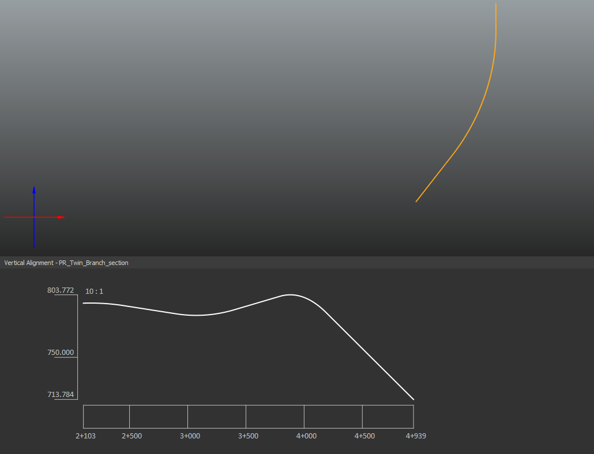
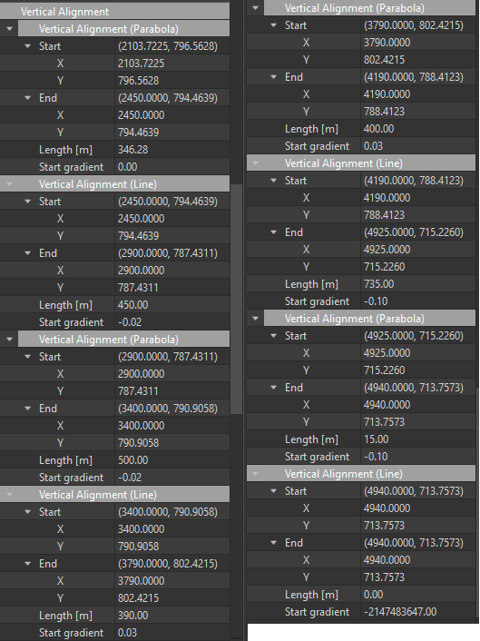

### Intent

This UT establishes a road alignment for the other INDOT unit tests

It is based on the storylines [INDOT IR_SLRH-C](https://app.box.com/file/731742565663?s=x8prri9nbc1n0x2bjaezeqxvkr9o03sw) storyline

### Prerequisites

None

### Content

This scenario covers the following concepts and/or IFC entities:

- Spatial structure
    - `IfcSite`
- Alignment
    - `IfcAlignment`
    - `IfcAlignmentHorizontal`
    - `IfcAlignmentVertical`
    - `IfcHorizontalSegment`
    - `IfcVerticalsegment`
- Geometry
    - `IfcCompositeCurve`
    - `IfcCurveSegment`
    - `IfcLine`
    - `IfcCircle`
    - `IfcGradientCurve`
    - `IfcPolynomialCurve`

### Situation

The figure below illustrates the horizontal and vertical alignments.

The horizontal elements are shown in the figure below.

The vertical elements are shown in the figure below.

### Expected Results

The aim of this Unit Test is to serve as a basis for the other unit tests from the INDOT storyline.

As such, the expected results are:

2. The resulting IFC file with an alignment and its geometric representation.

### Supporting files

Following files correspond to this scenario:

| Filename                               | Description                           |
| -------------------------------------- | ------------------------------------- |
| `PR_Twin_Branch_section_alignment.xml` | LandXML file with the alignment       |
| `PR_Twin_Branch_section_alignment.ifc` | Sample IFC 4.3 file for the alignment |
