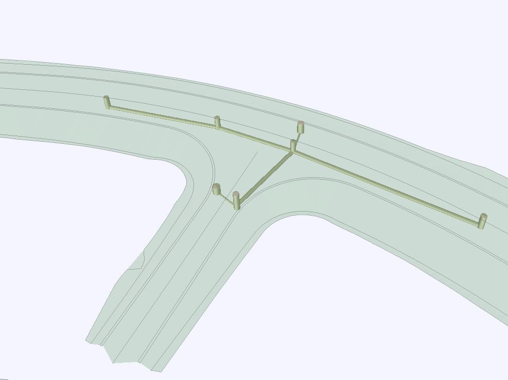

### Intent

This UT implements IfcDistributionSystem for road drainage with gullies/manholes and piped sewers.

It is based on storyline [bSFi-IR-SLRD-DD](https://app.box.com/s/x9q3q62tcc77hdqpdw0vjncj7bg3byay).

### Prerequisites

This scenario builds upon following other scenarios:

- SpatialStructure-4

### Content

This scenario covers the following concepts and/or IFC entities:

- spatial structure and containment
    - `IfcSite`
    - `IfcRoad`
    - `IfcFacilityPart` with correct `PredefinedType`
    - `IfcRelContainedInSpatialStructure`
    - `IfcRelReferencedInSpatialStructure`
- system structure
    - `IfcDistributionSystem` with correct `PredefinedType`
    - `IfcRelReferencedInSpatialStructure` to assign system to spatial element(s) it services
    - `IfcRelAssignsToGroup` to assign physical elements to the system
    - `IfcRelNests` to relate ports to physical elements
    - `IfcDistributionPort` with correct `PredefinedType` and `FlowDirection`
    - `IfcRelConnectsPorts` 
- physical elements 
    - `IfcDistributionChamberElement` with correct `PredefinedType`
    - `IfcPipeSegment` with correct`PredefinedType`

#### Situation

The start situation is described in the UT SpatialStructure-4 output (SpatialStructure-4.ifc).
In addition, DrainageSystem-1-2.xml provides top surface of road structures for reference.
The drainage system elements are given in DrainageSystem-1-1.xml.

#### Expected Results

Physical elements contained/referenced in the spatial structure set in UT SpatialStructure-4.
Should be visualised correctly compared to the supporting screenshots.
Physical elements grouped into one `IfcDistributionSystem`, which is assigned to `IfcRoad`.
Network topology using `IfcDistributionPort` and `IfcRelConnectsPorts`.

### Supporting files

Following files correspond to this scenario:

| Filename                 | Description                                                  |
| :----------------------- | ------------------------------------------------------------ |
| `DrainageSystem-1-1.xml` | Inframodel/LandXML: PipeNetwork with Structs and Pipes       |
| `DrainageSystem-1-2.xml` | Inframodel/LandXML: Top surface of the road and slopes/ditches |
| `DrainageSystem-1-3.jpg` | Inframodel/LandXML: Screenshot plan view                     |
| `DrainageSystem-1-4.jpg` | Inframodel/LandXML: Screenshot 3d view                       |
| DrainageSystem-1-1.ifc   | IFC file implementing the drainage system according to the above content description except that the `IfcRoad` was not decomposed into `IfcFacilityPart`. The physical objects have both an `Axis` and a `Body` representation. |

The xml files comply with the InfraModel 4 specification for LandXML 1.2. The specification is found here: https://buildingsmart.fi/infra/inframodel/

