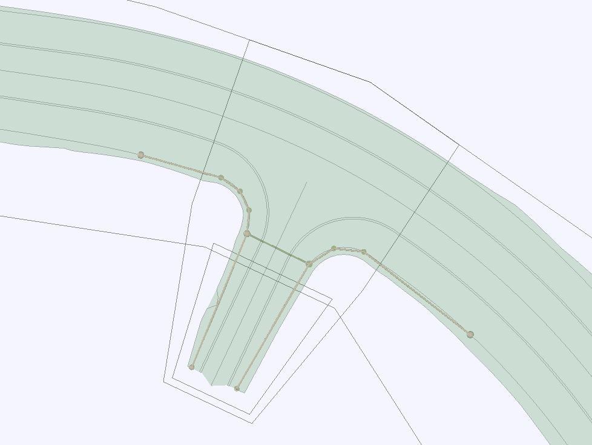
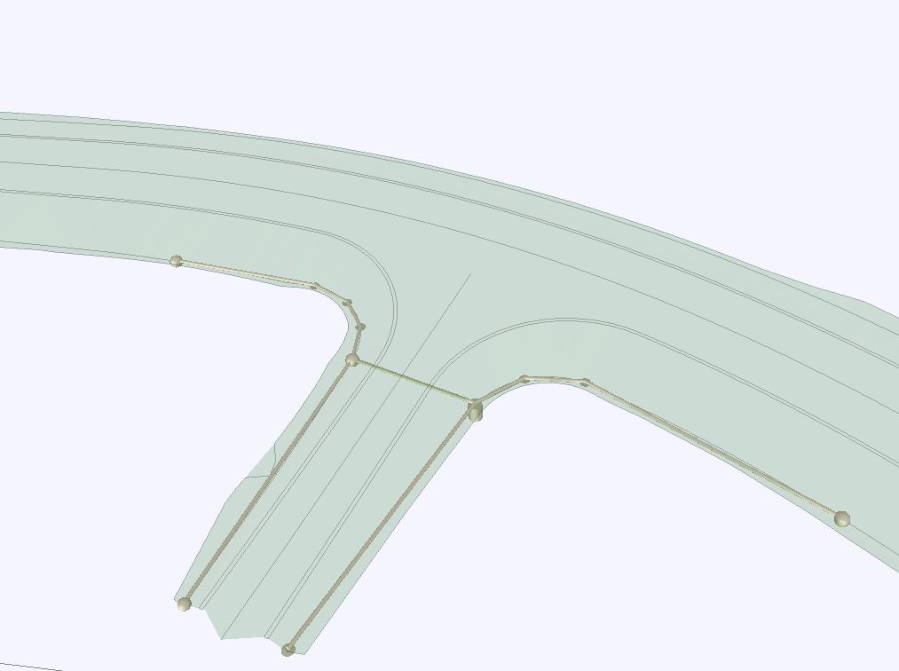

### Intent

This UT implements IfcDistributionSystem for road drainage with a culvert and open side ditches.

It is based on storyline `bSFi_IR_SLRD-DD` (https://app.box.com/s/x9q3q62tcc77hdqpdw0vjncj7bg3byay).

### Prerequisites

This scenario builds upon following other scenarios:
- SpatialStructure-4

### Content

This scenario covers the following concepts and/or IFC entities:
- spatial structure and containment
    - `IfcSite`
    - `IfcRoad`
    - `IfcFacilityPart` with correct `PredefinedType`
    - `IfcRelContainedInSpatialStructure`
    - `IfcRelReferencedInSpatialStructure`
- system structure
    - `IfcDistributionSystem` with correct `PredefinedType`
    - `IfcRelReferencedInSpatialStructure` to assign system to spatial element(s) it services
    - `IfcRelAssignsToGroup` to assign physical elements to the system
    - `IfcRelNests` to relate ports to physical elements
    - `IfcDistributionPort` with correct `PredefinedType` and `FlowDirection`
    - `IfcRelConnectsPorts` 
- physical elements 
    - `IfcDistributionChamberElement` with correct `PredefinedType`
    - `IfcPipeSegment` with correct`PredefinedType`

#### Situation

The start situation is described in the UT SpatialStructure-4 output (SpatialStructure-4.ifc).
In addition, DrainageSystem-2-2.xml provides top surface of road structures for reference.
The drainage system elements are given in DrainageSystem-2-1.xml.
Note: the open ditches are modeled here as LandXML Channel elements, roughly following the 
corresponding ditch bottom breakline in the surface model, but the number of bends, modeled as
Connections, is reduced for practical reasons. Also, the Channel dimensions do not necessarily 
match the slopes in the surface model.

#### Expected Results

Physical elements contained/referenced in the spatial structure set in UT SpatialStructure-4.
Should be visualised correctly compared to the supporting screenshots.
Physical elements grouped into one `IfcDistributionSystem`, which is assigned to `IfcRoad`.
Network topology using `IfcDistributionPort` and `IfcRelConnectsPorts`.

### Supporting files

Following files correspond to this scenario:

| Filename                 | Description                                                  |
| ------------------------ | ------------------------------------------------------------ |
| `DrainageSystem-2-1.xml` | Inframodel/LandXML: PipeNetwork with Structs and Pipes       |
| `DrainageSystem-2-2.xml` | Inframodel/LandXML: Top surface of the road and slopes/ditches |
| `DrainageSystem-2-3.jpg` | Inframodel/LandXML: Screenshot plan view                     |
| `DrainageSystem-2-4.jpg` | Inframodel/LandXML: Screenshot cross section view            |
| `DrainageSystem-2-5.jpg` | Inframodel/LandXML: Screenshot 3d view                       |
