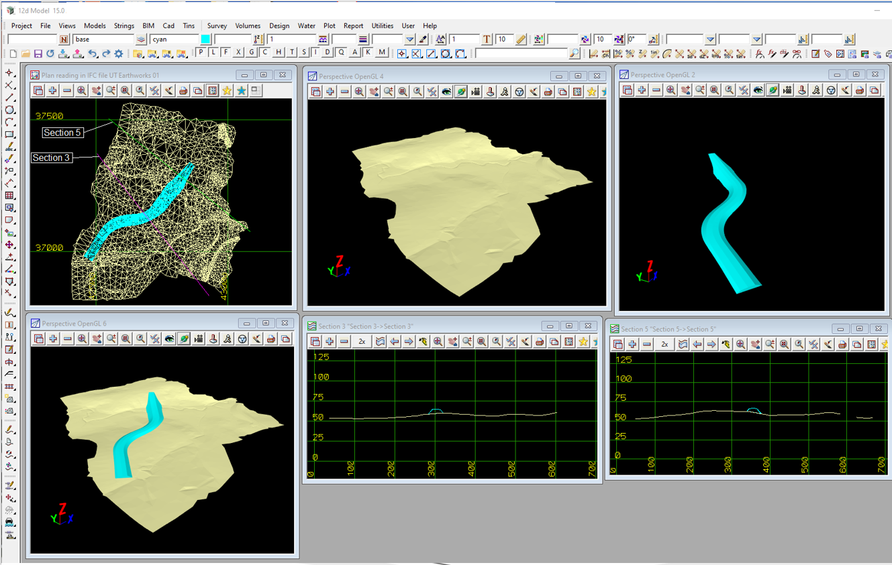

### Intent

This unit test establishes a simple embankment of infrastructure facilities.

### Prerequisites

This scenario builds upon following other scenarios:

- ProjectSetup-1
- Tin-1

### Content

This scenario covers the following concepts and/or IFC entities:

- `IfcEarthworksFill`
- `IfcEarthworksFillTypeEnum`

### Supporting files

### Results

The IFC file UT-Earthworks-01.ifc read into 12d Model, and the image from 12d Model shows the the two tins on a Plan view, in Persepctive views and with two sections through both tins.

Following files correspond to this scenario:

| Filename             | Description                                                  |
| -------------------- | ------------------------------------------------------------ |
| `UT-Earthworks-01.ifc` | IFC file with content                                        |
| `UT-Earthworks-01.png` | picture showing the TIN surface and embankment               |
| `UT-Earthworks-01.dwg` | drawing file with BricsCAD TIN Surface and watertight mesh representing embankment |
| `Earthworks-01-12d.png` | picture showing the IFC file read into 12d Model |
