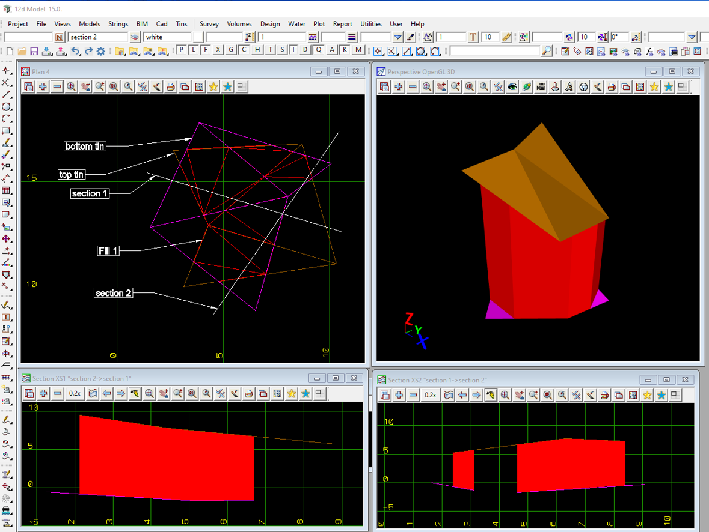

### Intent

This scenario has one earthworks cut object and the geometry of the element that was voided.

 

The IFC file was generated by 12d Model. 

### Prerequisites

This scenario builds upon the scenarios

- ProjectSetup-1
- Earthworks-12d-0

### Content

This scenario covers the additional concepts and/or IFC entities:

- `IfcEarthworksCut` with `PredefinedType=CUT`
- `IfcRelVoidsElement`

### Supporting files

Following files correspond to this scenario:

| Filename                 | Description                              |
|--------------------------|------------------------------------------|
| `Earthworks-12d-2.ifc`    | the exported content as IFC document     |
| `Earthworks-12d-2.png`    | screen shot from 12d Model               |
| `OIP` directory | screen shots from TUM OpenInfraPlatform   |

