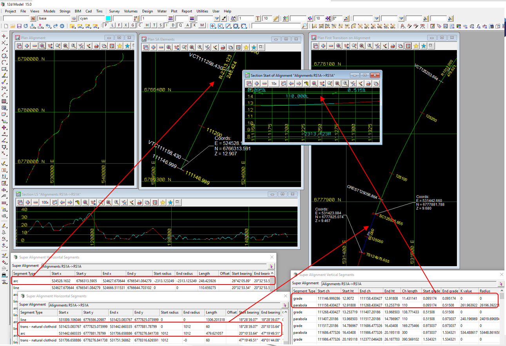

### Intent

The scenario is of a typical alignment from a real project.
The alignment has a 2D length of 33,876.059 Km and a non-zero start chainage of 111,146.9996. 

- the alignment includes:
     horizontal alignment: straights, IFC clothoids and arcs
	 horizontal alignment: start chainage of 111146.9996
     vertical alignment:   straights and parabolas

 

The IFC file was generated by 12d Model. 

### Prerequisites

This scenario builds upon the scenarios:

- Georeferencing-1
- Alignment-12d-8
- Alignment-12d-9
 
### Content

This example demonstrates a typical alignment for a road project.

### Supporting files

Following files correspond to this scenario:

| Filename                     | Description                                                                                                             |
|------------------------------------------------|---------------------------------------------------------------------------------------|
| `Georeferencing-Alignment-12d-1.png`           | image of an alignment in 12d Model with plan views showing the full alignment and the start of the alignment,a long section view with vertical exaggeration of 100 showing the full alignment and a longsection with vertical exaggeration of 10 showing the start of the alignment, plus segment reports showing the horizontal segments at the start of the alignment and at the first transition, and the vertical segments at the start of the alignment. |
| `Georeferencing-Alignment-12d-1.ifc`         | the exported content as an IFC 4x3 file with data in map Coordinates and map metres.              |

