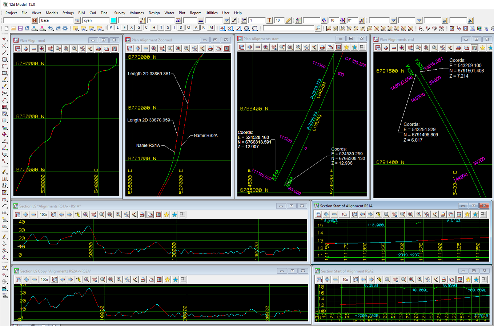

### Intent

The scenario is of typical alignments from a real project for a grade separated highway.
The alignment RS1A has a 2D length of 33,876.059 Km and a non-zero start chainage of 111,146.9996. 
The alignment RS2A has a 2D length of 33,869.361 Km and a non-zero start chainage of -53. 

- the alignment RS1A includes:
     horizontal alignment: straights, IFC clothoids and arcs
	 horizontal alignment: start chainage of 111146.9996
     vertical alignment:   straights and parabolas

- the alignment RS2A includes:
     horizontal alignment: straights, IFC clothoids and arcs
	 horizontal alignment: start chainage of -53
     vertical alignment:   straights and parabolas

 

The IFC file was generated by 12d Model. 

### Prerequisites

This scenario builds upon the scenarios:

- Georeferencing-Alignment-12d-1
 
### Content

This example demonstrates typical alignments for a grade separated road project.

### Supporting files

Following files correspond to this scenario:

| Filename                     | Description                                                                                |
|------------------------------------------------|---------------------------------------------------------------------------------------|
| `Georeferencing-Alignment-12d-2.png`           | image of the alignments in 12d Model with plan and section views showing import features of the alignments. |
| `Georeferencing-Alignment-12d-2.ifc`         | the exported content as an IFC file with data in map coordinates and map metres.              |

