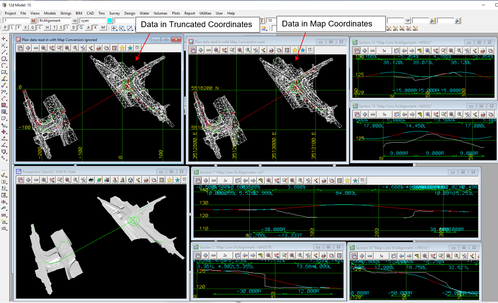

### Intent

An example that is based on a TUM IFC 4x1 file from the IFC 4x1 deployment project.

The scenario is to demonstrate reading and writing an IFC file using, and ignoring, IfcMapConversion, and so demonstrate the effect on alignments and tins.
Hence it combines three of the fundamental concepts needed for Civil BIM: georeferencing, alignments and tins.

The data is read in from a TUM IFC 4x1 file with tins and alignments in a Truncated Coordinate System
and the file has an IfcMapConversion to translate the data from Truncated Coordinates to Map Coordinates (Eastings and Northings).
There was no 2D rotation or change of scale for X and Y in the IfcMapConversion.

I don't know if the coordinates in the TUM file were truncated map coordinates or local engineering coordinates.
But being a real Civil project I suspect they are truncated map coordinates.

The TUM IFC 4x1 data consists of two tins and 5 alignments:

- the tins are simple tins with no holes and just one colour
- the alignments include:
     horizontal alignment: straights, IFC clothoids and arcs
     vertical alignment:   straights and parabolas

The TUM IFC 4x1 file has been:
 (a) Read into 12d Model using the IfcMapConversion parameters so that the data in 12d Model is in Map Coordinates (Eastings and Northings).
 (b) Read into 12d Model but NOT USING the IfcMapConversion parameters so that the data in 12d Model is in Truncated Coordinates.
 
IFC 4x3 RC2 files have been written out with: 
  (a) The data in the IFC 4x3 file in Eastings and Northings and the IfcMapConversion being an Identity (NOOP) transformation
       That is, zero 3D translation, zero 2D rotation and Scale of 1.
  (b) The data in the IFC 4x3 file is in Truncated Coordinates with an IfcMapConversion 
       to translate the coordinates to Map Coordinates (as in the original TUM IFC 4x1 file).
                     
For the alignments there is only the IFC semantic definition and no IFC geometry.

 

The IFC 4x1 file was read into 12d Model and IFC 4x3 files generated by 12d Model. 

### Prerequisites

This scenario builds upon the scenarios:

- Georeferencing-1
- Tin-1
- Georeferencing-Tin-12d-1
- Georeferencing-Tin-12d-2
- Alignment-12d-1
- Alignment-12d-3
- Alignment-12d-4
 
### Content

Apart from reading in an IFC 4x1 file, this scenario covers no additional concepts.
But it demonstrates the three fundamental concepts needed for Civil BIM: georeferencing, alignments and tins

### Supporting files

Following files correspond to this scenario:

| Filename                     | Description                                                                                                             |
|------------------------------------------------------------|---------------------------------------------------------------------------------------|
| `terrain-surface-ifcAlignment1x1-fixed-names.ifc`          | TUM IFC 4x1 file to import                                                            |
| `ex-terrain-alignment.png`                                 | image of TUM file in TUM software                                                     |
| `Georeferencing-Alignment-Tin-12d-1.png`                    | image of TUM data in 12d Model (a) with Truncated Coordinates (b) and Map Coordinates and long sections of each aligment with the two tins |
| `Georeferencing-Alignment-Tin-12d-1-Map-Coords.ifc`         | the exported content as an IFC 4x3 file with data in Map Coordinates              |
| `Georeferencing-Alignment-Tin-12d_1-Truncated-Coords-in-file.ifc`   | the expoerted content as an IFC 4x3 file with data in Truncated Coordinates       |

