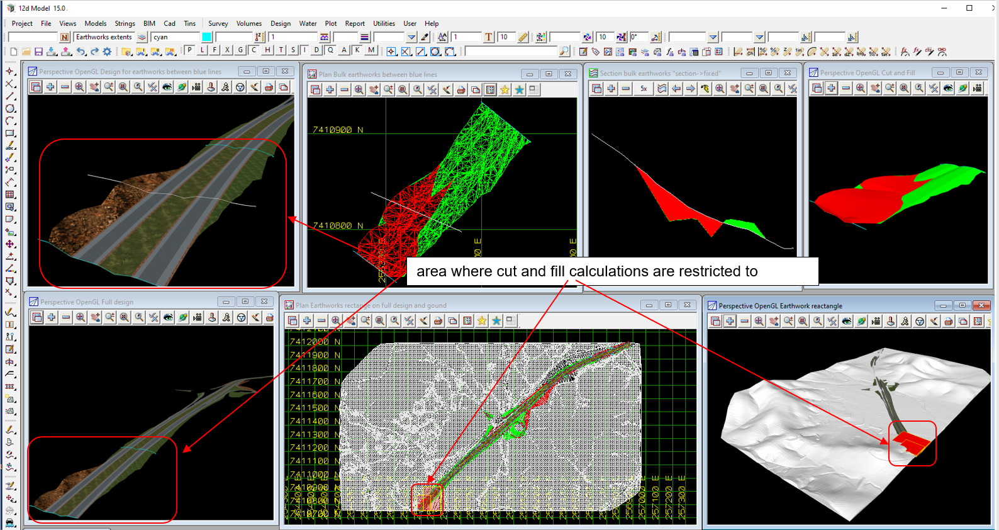

### Intent

This scenario has cut and fill elements for bulk earthworks for a small part of a job (blue lines show the extent on the road and red boxes around the area on views).

The cut and fill objects are output.
However the voided object (Ground) is large and not required so only the semantics for Ground is included and no geometry.
 
All data in the file is in map coordinates MGA2020 and height datum AHD.

The overall ground tin and the rectangle of the area of bulk earthworks is given in the following image:

The IFC file was generated by 12d Model. 

### This builds on scenarios

- Georeferencing-Earthworks-12d-1

### Content

This scenario covers the extra concepts and/or IFC entities:

- `IfcSolidStratum` with no `IfcSolidStratum.Representation` 

### Supporting files

Following files correspond to this scenario:

| Filename                                | Description                              |
|-----------------------------------------|------------------------------------------|
| `Georeferencing-Earthworks-12d-2.ifc`    | the exported content as IFC document     |
| `Georeferencing-Earthworks-12d-2.png`    | screen shot from 12d Model               |

