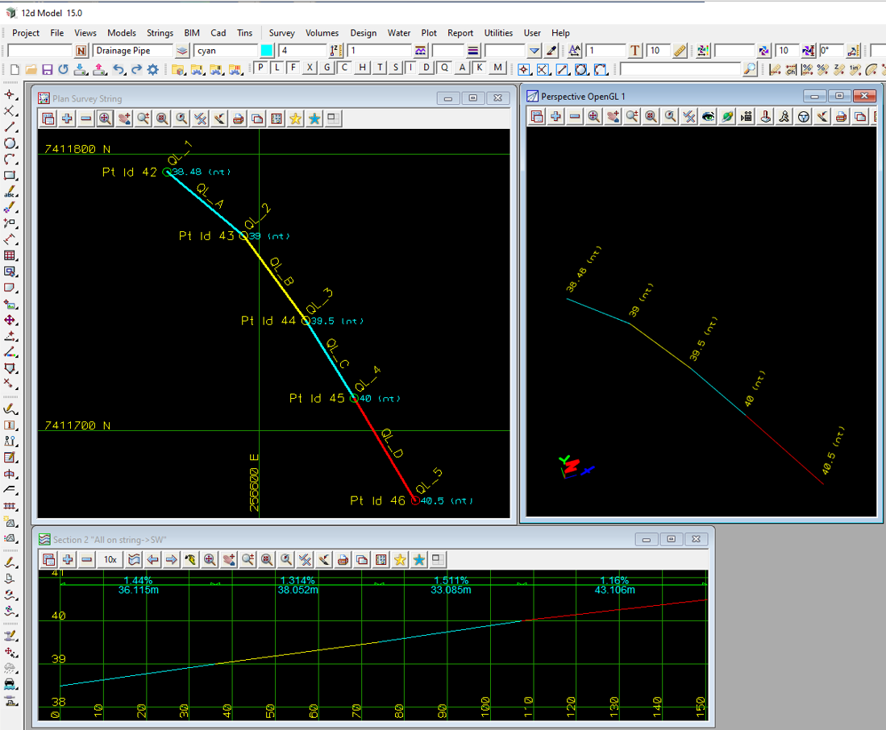

### Intent

Survey data is collected from the very beginning of a project and the position and elevation of any other data in the project must be tied back to accurate survey.  
Survey data starts with points and strings which are an ordered set of points (vertices) vertices connected by segments.
So a survey point is just a survey string with only one vertex.
 
As well as collecting the (x,y) and sometimes a z for each vertex, surveyors also collect properties for the entire string, properties for each vertex of the string and properties for each segment of the string.
For example when picking up the top of a buried pipe, the Quality level can vary for each vertex and for each segment of the pipe.

However I have no idea how these prperties can be represented in IFC.
So as a start I have mapped the Property set for the vertices and segments to Property Sets for IfcAnnotation with:

- Property sets with properties for the entire string
- Property set Vertex with the properties for each vertex with the property name for a vertex appended by the number for the vertex (starting at 1)
- Property set Segment with the properties for each segment with the property name for a segment appended by the number for the segment (starting at 1)

This encoding is to allow the process to be reversed when read into another software package. 

So this scenario covers one simple survey string with property sets for the entire string, property sets for vertex properties and property sets for segment properties

I am definitely happy to hear any suggestions on how slese this could be done.

This IFC file has a survey consisting of:

- one survey string with name "RD ET"
- Property Set "SW" with properties STRMATERIAL, STRSHAPE and STRDIAMETER
- Property Set "Vertex" containing Property sets "SW" and "PT ID" 
- Property Set "Segment" containing Property sets "SW" 

The coordinates are in Easting, Northing and AHD for the map projection MGA2020 Zone 56.
The Horizontal and Vertical datums, and Map Projection, are specified in IfcProjectedCRS.
IfcMapConversion is a "No Operation" as the data in the file is already in map coordinates and needs no further transformation. 

The IFC file was written by 12d Model. 

### Prerequisites

This scenario builds upon following other scenarios:

- Georeferencing-Survey-12d-2

### Content

This scenario covers the following new concepts and/or IFC entities:

-  `IfcComplexProperty`
-  `IfcPropertySingleValue` with `IfcPropertySingleValue.Nominalvalue` IFCLABEL
-  `IfcPropertySingleValue` with `IfcPropertySingleValue.Nominalvalue` IFCREAL

### Supporting files

Following files correspond to this scenario:

| Filename                           | Description                        |
|------------------------------------|------------------------------------|
| `Georeferencing-Survey-12d-3.ifc`  | the exported content as IFC document |
| `Georeferencing-Survey-12d-3.png`      | screen shot from 12d Model           |
| `Georeferencing-Survey-12d-3-RDF-ifcviewer.png`      | screen shot from RDF ifcviewer      |

