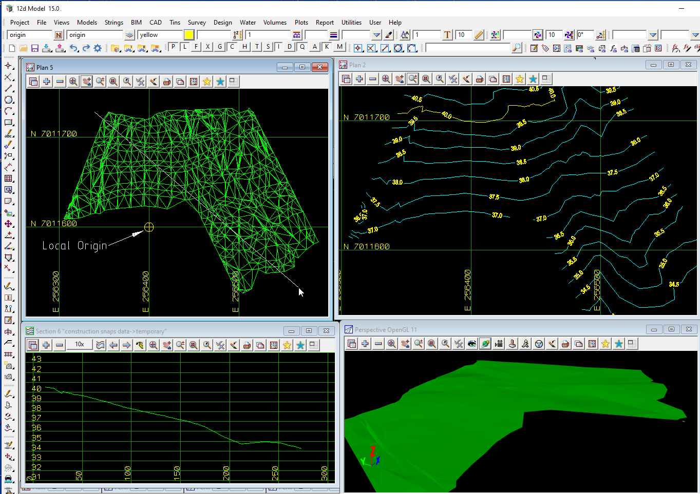

### Intent

This scenario has a TIN with coordinates for `IfcTriangulatedIrregularNetwork` in map metres but using a local origin of (256400.0, 7011600.0, 0.0) to truncate the coordinates.
IfcMapConversion is used to translate the tin to the correct (Easting, Northing, Height) for the map projection.

The data is already in map metres so Scale, ScaleY and ScaleZ are 1.
The Horizontal and Vertical datums are specified in `IfcProjectedCRS`.

The TIN has one colour for all the triangles and there are no voids in the TIN.

Special note: the data is *NOT* in local engineering coordinates.
The units for *x* and *y* are map metres and not ground metres.

The IFC file was created by 12d Model.

### Prerequisites

This scenario builds upon the other scenarios:

- Georeferencing-Tin-12d-1

### Content

This scenario covers the additional concepts and/or IFC entities:

- `IfcMapConversion` is used to translate the data from truncated map coordinates (a local origin) to map coordinates. 

### Supporting files

Following files correspond to this scenario:

| Filename                       | Description                               |
|:-------------------------------|-------------------------------------------|
| `Georeferencing-Tin-12d-2.ifc` | the exported content as IFC document      |
| `Georeferencing-Tin-12d-2.png` | screen shot from 12d Model                |

