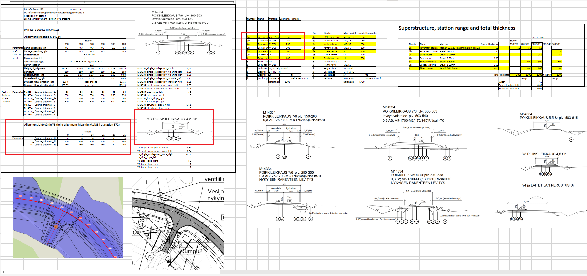

### Intent

This UT implements builds on the MCON-1 unit test and adds definitions for the road superstructure (IfcPavement and IfcCourse) to test requirements based on storyline [TC127-IR-SLRH-C-MCON](https://app.box.com/folder/122373399568?s=fr6k8xqud6uug6ep0s158uxtb70doxcd). Particularly the exchange scenarios 1 (alignment) and 4 (Requirements of final product). Regarding exchange scenario 4, this unit test particularly tests the use of IfcAnnotation/SUPERELEVATIONEVENT, IfcAnnotation/WIDTHEVENT, IfcPavement and IfcCourse together with a lateral breakdown of the facility parts from [SpatialStructure-4](https://github.com/bSI-InfraRoom/IFC-infra-unit-test/tree/main/SpatialStructure-4) and linear placement of the objects along the alignments.

### Prerequisites

This scenario builds upon following other scenarios:

- SpatialStructure-4
- MCON-1

### Content

This scenario covers the following concepts and/or IFC entities:

- spatial structure and containment
    - `IfcSite`
    - `IfcRoad`
    - `IfcFacilityPart` with correct `PredefinedType` (UsageType both LONGITUDINAL and LATERAL)
    - `IfcRelContainedInSpatialStructure`
    - `IfcRelReferencedInSpatialStructure`
- Physical elements 
    - `IfcAlignment`
    - `IfcLinearPlacement`
    - `IfcAnnotation` with correct `PredefinedType` and Psets
    - `IfcPavement`
        - `Pset_PavementCommon`
    - `IfcCourse`
        - `Pset_CourseCommon`

### Situation

The start situation is described in the UT SpatialStructure-4 output (SpatialStructure-4.ifc).

The area of concern is especially the part where the main road (M14334 - starting from the railway level crossing) intersects with the smaller road Y3 (Road2 in the spatial structure).

Typical cross-section definitions are given in \ref{Figure-3}

In \ref{Figure-4}, the changes of superelevations and widths along the alignments are shown.

In \ref{Figure-5}, the definitions of the superstructures are marked within red boxes.

### Expected Results

- A spatial structure based on UT [SpatialStructure-4](https://github.com/bSI-InfraRoom/IFC-infra-unit-test/tree/main/SpatialStructure-4)
- The main alignment (M14334) contained at IfcSite level
- The alignment for the side road (Y3/Road2) contained at IfcRoad level
- The necessary facility parts subdivided further laterally into CARRIAGEWAY, SOFTSHOULDER (left and right), ROADSIDEPART (Sideslope left and right) and ROADSIDEPART (back slope left and right)
    - These are used to contain the IfcAnnotation/SUPERELEVATION and IfcAnnotationWidth objects with the specified values as properties
- Linear placements along the alignments for the longitudinal facility parts and the IfcAnnotation objects
- The carriageway facility parts containing the IfcPavement with the aggregated IfcCourse objects including linear placements along the alignments for these

### Supporting files

Following files correspond to this scenario:

| Filename                     | Description                                                  |
| :--------------------------- | ------------------------------------------------------------ |
| `TOI-M14334-0000A.xml`       | Inframodel/LandXML: Alignment for main road                  |
| `TOI-M14334-0000A.ifc`       | IfcAlignment for main road                                   |
| `TOI-Y3-0000A.xml`           | Inframodel/LandXML: Alignment for side road                  |
| `TOI-Y3-0000A.ifc`           | Inframodel/LandXML: Alignment for side road                  |
| `M14334-Cross-section.png`   | Image showing the typical cross sections                     |
| `Superelevations-Widths.png` | Image showing the changes of superelevations and widths along the alignments |
| `Pavement-composition.png`   | Image showing the pavement composition (marked with red boxes) |
| `MCON-2.ifc`                 | Resulting IFC-file                                           |

The xml files comply with the InfraModel 4 specification for LandXML 1.2. The specification is found here: https://buildingsmart.fi/infra/inframodel/
