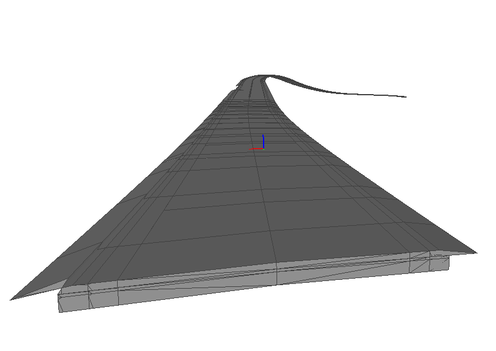
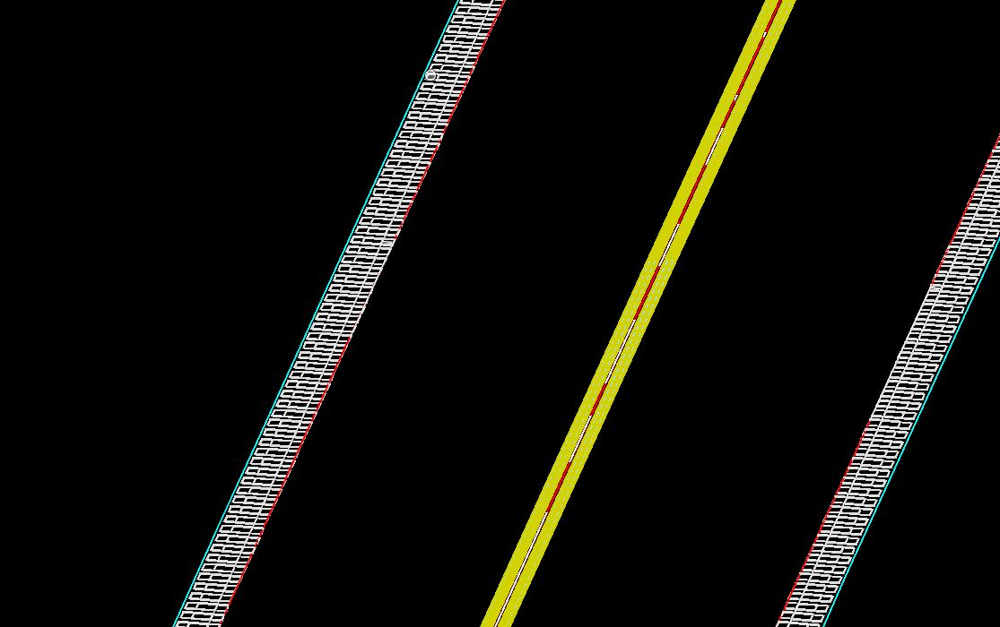

### Intent

This UT establishes a an IfcPavement with IfcCourse objects that has associated IfcSurfaceFeature/RUMBLESTRIP.

It is based on the storylines [INDOT IR-SLRH-C](https://app.box.com/file/731742565663?s=x8prri9nbc1n0x2bjaezeqxvkr9o03sw) storyline

### Prerequisites

Files from Alignment-INDOT may be used as input if alignment data is needed.

### Content

This scenario covers the following concepts and/or IFC entities:

- Spatial structure
    - `IfcSite`
    - `IfcRoad`
- Physical elements
    - `IfcPavement`
    - `IfcCourse`
    - `IfcSurfaceFeature/RUMBLESTRIP`
- Geometry
    - `IfcPolygonalFaceSet`

### Situation

There is an IFC4 file containing the pavement elements.

There is also an IFC4 file containing the rumble strips.

### Expected Results

The aim of this Unit Test is to test the representation of surface features such as rumble strips.

As such, the expected results are:

1. An IFC-file with the pavement as an IfcPavement object containing the different pavement layers as IfcCourse objects. 
2. The rumble strips shall be represented as IfcSurfaceFeature/RUMBLESTRIP which occur in the decomposition of the IfcCourse objects.
3. A 3D rendering of the result

### Supporting files

Following files correspond to this scenario:

| Filename                                           | Description                                                  |
| -------------------------------------------------- | ------------------------------------------------------------ |
| `PR-Twin-Branch-PavementElements.ifc`              | Modeled road elements saved to IFC4 using Bentley OpenRoads Designer (ORD) |
| Twin-Branch-Surface-Features.ifc                   | Modeled surface features saved to IFC4 using Bentley OpenRoads Designer (ORD) |
| `FT Plans 1of13 0500430 Typical Section.pdf`       | Pdf plan sheet showing typical section for Twin Branch Road  |
| `FT Plans 4of13 0500430 for Contract Services.pdf` | Pdf plan sheets showing plan and profile view for Twin Branch Road |
| `FT Xsect 2of2 0500430 for Contract Services.pdf`  | Pdf plan sheets showing cross sections for Twin Branch Road  |
| PavementElements-png                               | Illustration of the road elements                            |
| SurfaceFeatures.jpg                                | Illustration of the surface features                         |
| RumbleStrip-INDOT                                  | Example IFC 4.3 file                                         |
