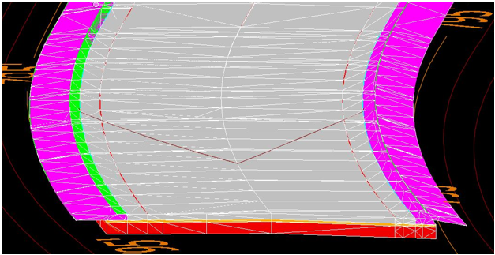

### Intent

This UT establishes a an IfcPavement with an IfcCourse represented by an IfcSectionedSurface.

It is based on the storylines [INDOT IR_SLRH-C](https://app.box.com/file/731742565663?s=x8prri9nbc1n0x2bjaezeqxvkr9o03sw) storyline

### Prerequisites

Unit test Alignment-INDOT

### Content

This scenario covers the following concepts and/or IFC entities:

- Spatial structure
    - `IfcSite`
    - `IfcRoad`
- Alignment
    - From unit test Alignment-INDOT
- Physical elements
    - `IfcPavement`
    - `IfcCourse`
- Geometry
    - `IfcSectionedSurface`
    - `IfcOpenCrossProfileDef`

### Situation

The figure below illustrates the horizontal and vertical alignments.

The typical section used for the unit test is shown in the figure below.

### Expected Results

The aim of this Unit Test is to serve as a basis for the other unit tests from the INDOT storyline.

As such, the expected results are:

1. An IFC-file with the IfcOpenCrossProfileDef at least defining the uppermost surface between the road shoulders and the IfcSectionedSurface using the alignment geometry as directrix
2. A 3D rendering of the result

### Supporting files

Following files correspond to this scenario:

| Filename                                           | Description                                                  |
| -------------------------------------------------- | ------------------------------------------------------------ |
| `PR_Twin_Branch_SectionedSurface.ifc`              | Modeled road elements saved to IFC4 using Bentley OpenRoads Designer (ORD) |
| `PR_Twin_Branch_section_alignment.xml`             | Landxml file containing the centerline alignment and vertical profile. |
| `PR_Twin_Branch_section_alignment.ifc`             | IFC 4.3 file containing the centerline alignment and vertical profile |
| `Combined Terrain tin file.xml`                    | Landxml file containing the terrain model                    |
| `FT Plans 1of13 0500430 Typical Section.pdf`       | Pdf plan sheet showing typical section for Twin Branch Road  |
| `FT Plans 4of13 0500430 for Contract Services.pdf` | Pdf plan sheets showing plan and profile view for Twin Branch Road |
| `FT Xsect 2of2 0500430 for Contract Services.pdf`  | Pdf plan sheets showing cross sections for Twin Branch Road  |
| `Horizontal.png`                                   | Horizontal alignment element listing  |
| `Illustration.png`                                 | Illustration of the horizontal and vertical alignments  |
| `Vertical.png`                                     | Vertical alignment element listing  |
