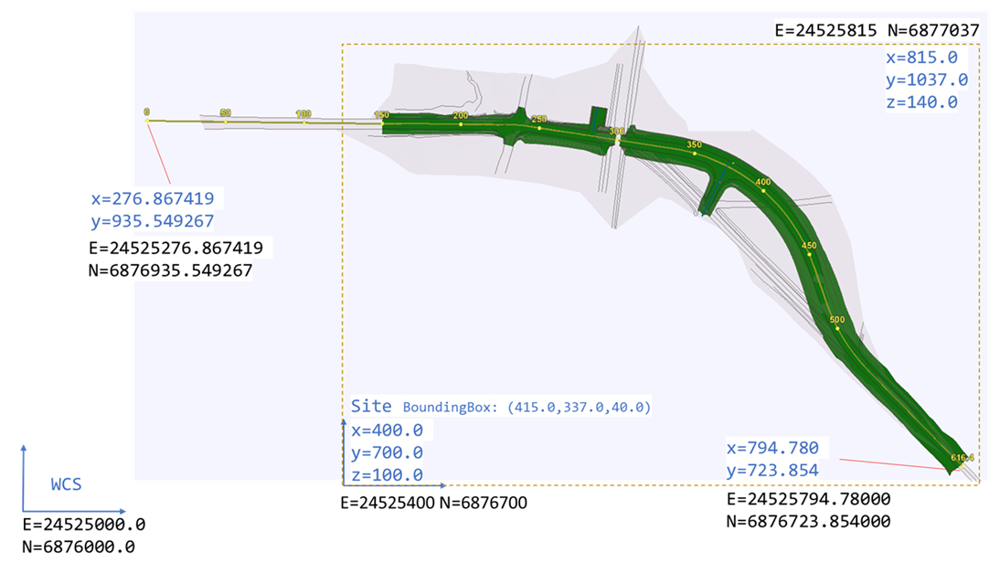
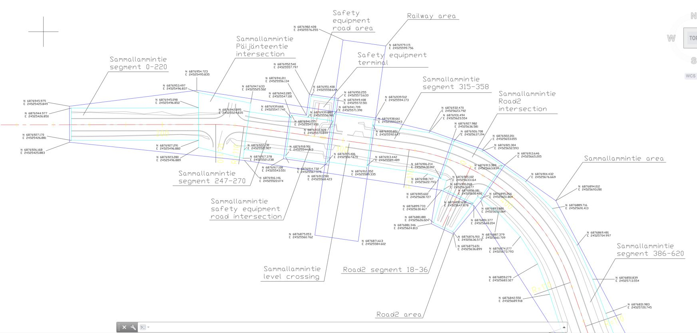
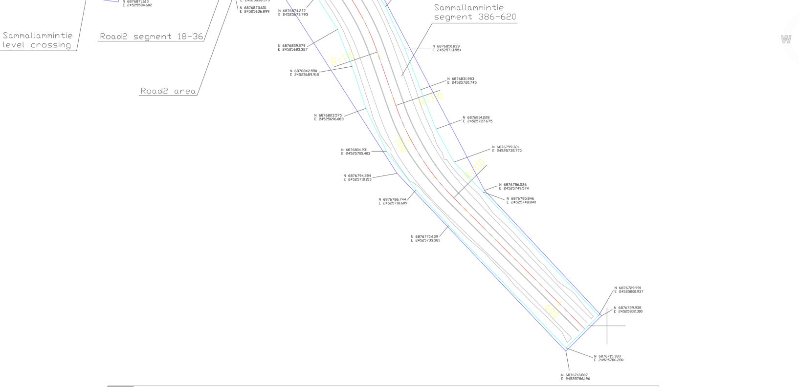
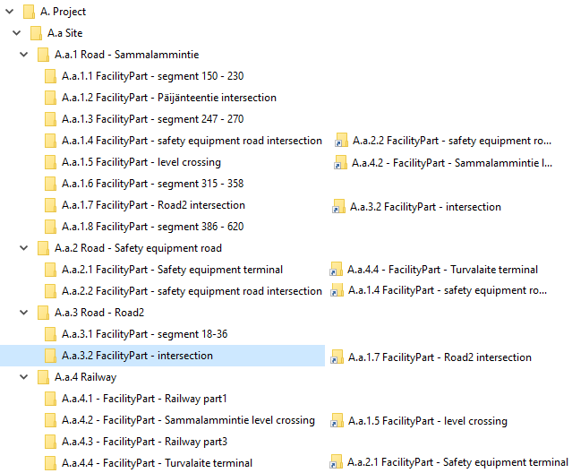

### Intent

This UT establishes a spatial structure for the level crossing storyline. The intention is to serve as a skeleton for upcoming unit tests for this storyline.

It is based on the storylines [SLLC-DD](https://app.box.com/folder/119147119179?s=q1x0vz7yqq7otrlet7dm2dx4u44s8fks) (IFC Rail phase 2) and [bSFi_IR_SLRD_DD](https://app.box.com/folder/122373280942?s=x9q3q62tcc77hdqpdw0vjncj7bg3byay) (IFC Infra Deployment)

### Prerequisites

None

### Content

This scenario covers the following concepts and/or IFC entities:

- Georeferencing
    - `IfcProjectedCRS`
    - `IfcMapConversion`
- Spatial structure
    - `IfcSite`
    - `IfcRailway`
    - `IfcRoad`
    - `IfcFacilityPart` with correct `PredefinedType`
    - `IfcRelInterferesElements`
- Geometry
    - `IfcExtrudedAreaSolid`
    - `IfcBoundingBox`

### Situation

The figure below shows the extent of the IfcSite and its georeferenced location.

The figures below shows the spatial breakdown of the project into IfcFacility (blue) and IfcFacilityPart (turkoise).

### Expected Results

The aim of this Unit Test, as explained above, is to test the implementation of the project breakdown through the spatial structure concepts of IFC 4.3.

As such, the expected results are:

1. Screen-shot of the spatial structure breakdown as represented in the native application,
2. The resulting IFC file containing the spatial structure requested.

For example, the application should be able to display something like what is shown in the picture below: 

### Supporting files

Following files correspond to this scenario:

| Filename                          | Description                                                  |
| --------------------------------- | ------------------------------------------------------------ |
| `SpatialStructure-4.ifc`          | IFC file with the content                                    |
| `Figure1-Situation.png`           | picture showing a map view of the situation                  |
| `Figure2-ToivolaAreaBorders.JPG`  | picture showing a map over different facilities and parts - part1 |
| `Figure3-ToivolaAreaBorders2.JPG` | picture showing a map over different facilities and parts - part 2 |
| `Figure4-result.png`              | picture showing possible result                              |
| `ToivolaAreaBorders.dwg`          | dwg file as basis for figures 2 and 3                        |
| `IFCTreeView.png`                 | picture showing file structure in IFCTreeView                |
