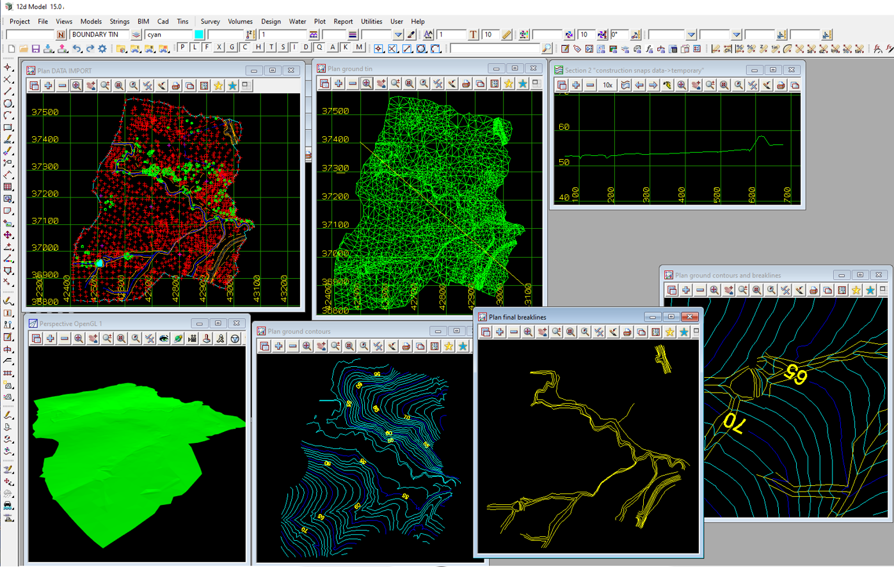

### Intent

This scenario has a simple TIN with some holes/voids. 

The IFC file was created by 12d Model. 

### Prerequisites

This scenario builds upon following other scenarios:

- ProjectSetup-1

### Content

This scenario covers the following concepts and/or IFC entities:

- construction site context 
    - start of the project structure
    - `IfcSite`
    - `IfcRelAggregates`
- placement
    - `IfcLocalPlacement`
- product
    - `IfcSolidStratum`
- product representation
    - `IfcProductDefinitionShape`
    - `IfcShapeRepresentation`
- representation
    - `IfcTriangulatedIrregularNetwork`
        - triangles have flags -2 / -1 / 7
    - `IfcCartesianPointList3D`

### Supporting files

Following files correspond to this scenario:

| Filename                     | Description                               |
|:------------------------------|-------------------------------------------|
| `Tin-1.ifc`                   | the exported content as IFC document      |
| `Tin-1-1.png`                 | screen shot from 12d Model                |
| `Tin-1-2.png`                 | screen shot from OpenInfraPlatform        |

